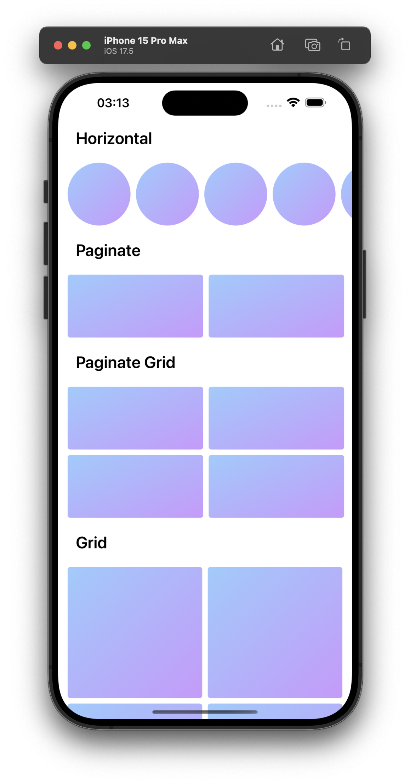

# 📱 UICollectionView Compositional Layout Usages
This project utilizes UICollectionViewCompositionalLayout to create different types of sections. Each section is designed with different layouts and scrolling behaviors. The project is developed using UIKit to provide a dynamic and modern user interface.

# 🚀 Features:
Dynamic Layouts: Custom layouts for different section types.
Horizontal Scrolling: Sections with horizontal scrolling capabilities.
Gradient Design: Gradient background design for each cell.
Header View: Custom headers for each section.
#💡 Technologies Used:
UIKit
UICollectionView
UICollectionViewCompositionalLayout
CAGradientLayer (Gradient Background)

# 📸 Screenshots:

   

# 🔧 Setup:
Clone this repository:

bash
Copy
Edit
git clone https://github.com/ibrahim-demirci/ios-uikit-uicolletionview-compositionallayout-usage.git
Open the project in Xcode and run it.

